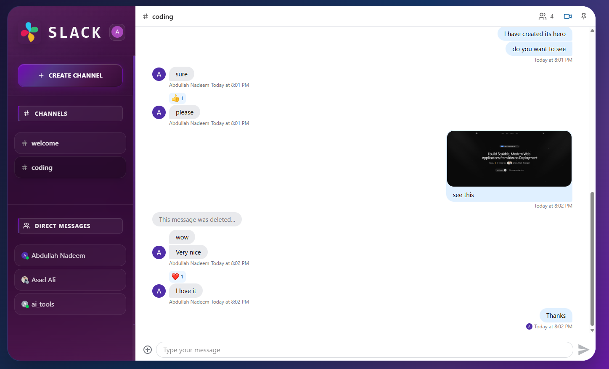

# Slack Clone

A full-stack real-time communication platform inspired by Slack. This application enables users to communicate seamlessly through text messaging and video calls. Built with a modern tech stack, it features secure authentication, real-time message updates, and high-quality video conferencing capabilities. The project demonstrates a robust architecture separating frontend and backend concerns, ensuring scalability and maintainability.

## 📸 Screenshots


_Home page showing chat interface_


_Video calling interface_

## ✨ Features

- **Real-time Messaging**: Instant text communication using Stream Chat.
- **Video Calls**: High-quality video conferencing powered by Stream Video.
- **Authentication**: Secure user sign-up and sign-in via Clerk.
- **Responsive Design**: Fully responsive UI built with TailwindCSS for mobile and desktop.
- **State Management**: Efficient data fetching and caching with TanStack React Query.
- **Background Jobs**: Event-driven architecture using Inngest for reliable background processing.

## 🛠️ Tech Stack

### Frontend

- **Framework**: React (Vite)
- **Styling**: TailwindCSS
- **State Management**: TanStack React Query
- **Authentication**: Clerk
- **Real-time/Video**: Stream Chat & Video SDKs
- **Routing**: React Router
- **HTTP Client**: Axios

### Backend

- **Runtime**: Node.js
- **Framework**: Express.js
- **Database**: MongoDB (Mongoose)
- **Authentication**: Clerk SDK
- **Real-time**: Stream Chat SDK
- **Background Jobs**: Inngest

## 🚀 Getting Started

### Prerequisites

- Node.js (v18 or higher)
- MongoDB instance
- Clerk account
- Stream account

### Environment Variables

Create `.env` files in both `frontend` and `backend` directories based on the examples provided.

**Frontend (`frontend/.env`)**

```env
VITE_CLERK_PUBLISHABLE_KEY=your_clerk_publishable_key
VITE_SENTRY_DSN=your_sentry_dsn
VITE_STREAM_API_KEY=your_stream_api_key
MODE=development
```

**Backend (`backend/.env`)**

```env
PORT=3000
NODE_ENV=development
MONGODB_URI=your_mongodb_connection
CLERK_PUBLISHABLE_KEY=your_clerk_publishable_key
CLERK_SECRET_KEY=your_clerk_secret_key
STREAM_API_KEY=your_stream_api_key
STREAM_API_SECRET=your_stream_api_secret
SENTRY_DSN=your_sentry_dsn
INNGEST_EVENT_KEY=your_inngest_event_key
INNGEST_SIGNING_KEY=your_inngest_signing_key
CLIENT_URL=http://localhost:5173/
```

### Installation & Running

1.  **Clone the repository**

    ```bash
    git clone <repository-url>
    cd Slack-Clone
    ```

2.  **Setup Backend**

    ```bash
    cd backend
    npm install
    npm run dev
    ```

    The backend server will start on `http://localhost:3000`.

3.  **Setup Frontend**
    Open a new terminal window:
    ```bash
    cd frontend
    npm install
    npm run dev
    ```
    The frontend application will start on `http://localhost:5173`.

## 📄 License

MIT License


## 👨‍💻 Developer

<div align="center">
  
**Asad Ali**  
*Full Stack Web Developer*

[](mailto:message.asadali@gmail.com)
[](https://www.linkedin.com/in/asadaliofficials/)
[](https://github.com/asadaliofficials)

</div>